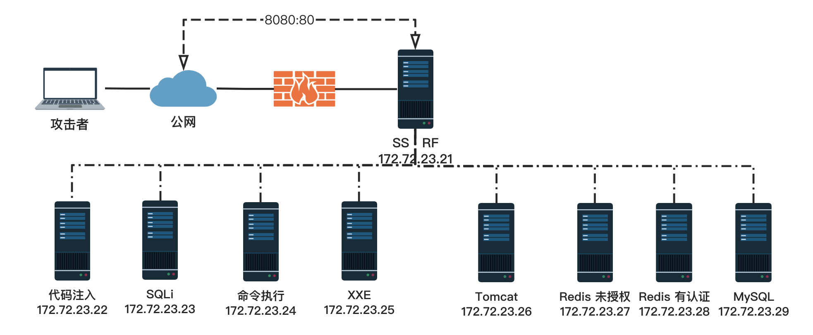
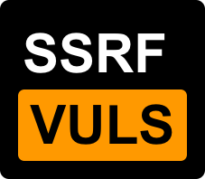

 

# 靶场拓扑设计

首先来看下本次靶场的设计拓扑图：

          

先理清一下攻击流程，172.72.23.21 这个服务器的 Web 80 端口存在 SSRF 漏洞，并且 80 端口映射到了公网的 8080，此时攻击者通过这个 8080 端口可以借助 SSRF 漏洞发起对 172 目标内网的探测和攻击。

本场景基本上覆盖了 SSRF 常见的攻击场景，实际上 SSRF 还可以攻击 FTP、Zabbix、Memcached 等应用，由于时间和精力有限，先挖个坑，以后有机会的话再补充完善这套 SSRF 攻击场景的。 

# WP

 
<a href="https://www.sqlsec.com/2021/05/ssrf.html">手把手带你用 SSRF 打穿内网 | 国光]</a>

